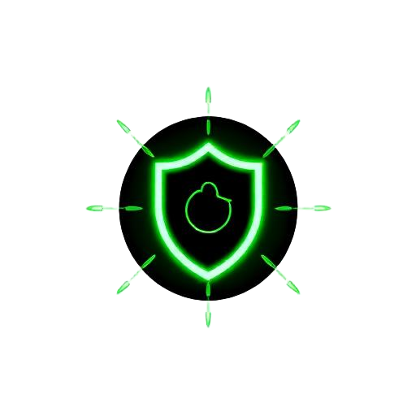

<p align="center">
  
</p>

<h1 align="center">VulnRadar</h1>

<p align="center">
  <b>Real-time web vulnerability scanner with AI-powered analysis</b><br/>
  <sub>DNS · SSL/TLS · Subdomains · Sensitive Files · Port Scanning · SQLi/XSS · CORS · Open Redirects</sub>
</p>

<p align="center">
  
  
  
  
  
</p>

---

## ✨ Features

| Module | Description |
|--------|-------------|
| **DNS Reconnaissance** | A, AAAA, MX, NS, TXT, CNAME, SOA record enumeration via public DNS-over-HTTPS |
| **Subdomain Enumeration** | Brute-force discovery of 100 common subdomains with live resolution |
| **HTTP Header Analysis** | Security header audit (HSTS, CSP, X-Frame-Options, Permissions-Policy, etc.) |
| **SSL/TLS Inspector** | Certificate validity, expiry, issuer, protocol, and grading |
| **Sensitive File Detection** | Probes for exposed `.env`, `.git/config`, `wp-config.php`, `phpinfo.php`, and more |
| **Web Spider** | Crawls up to 20 pages at depth 2 to map the attack surface |
| **Port Scanner** | Probes 20 common service ports with timeout-based detection |
| **SQL Injection Testing** | 15 payloads across discovered endpoints with error-based detection |
| **XSS Testing** | 14 reflected XSS payloads with response reflection analysis |
| **CORS Misconfiguration** | Tests for wildcard origins, credential leaks, and null origin acceptance |
| **Open Redirect Detection** | Scans 10 common parameters across 7 endpoint patterns |
| **Certificate Transparency** | Queries crt.sh for historically issued certificates |
| **AI Executive Summary** | Gemini-powered analysis generating a professional pentest executive summary |
| **Scan Comparison** | Side-by-side diff of two scan results to track security posture changes |

## 🖥️ Screenshots

<details>
<summary>Click to expand</summary>

> _Run the app locally and scan a target to see the full UI in action._

</details>

## 🏗️ Architecture

```
┌─────────────────────────────────────┐
│           React Frontend            │
│  (Vite + TypeScript + Tailwind)     │
├─────────────────────────────────────┤
│         Scanner API Client          │
│   Sequential phase orchestration    │
│   ┌───────┐ ┌────────┐ ┌────────┐  │
│   │ Recon │→│ Active │→│ Attack │  │
│   └───────┘ └────────┘ └────────┘  │
├─────────────────────────────────────┤
│      Supabase Edge Functions        │
│  scan-target  │  ai-analyze         │
├─────────────────────────────────────┤
│     External APIs & Services        │
│  DNS-over-HTTPS │ crt.sh │ Gemini  │
└─────────────────────────────────────┘
```

The scan is split into **three sequential phases** to stay within edge function compute limits:

1. **Recon** — DNS records, subdomain enumeration, HTTP headers, redirect chain
2. **Active** — Sensitive file probing, SSL analysis, web spidering, port scanning
3. **Attack** — SQLi/XSS injection testing, CORS checks, open redirect detection

## 🚀 Getting Started

### Prerequisites

- [Node.js](https://nodejs.org/) v18+
- [Supabase CLI](https://supabase.com/docs/guides/cli) (for edge functions)

### Installation

```bash
# Clone the repository
git clone https://github.com/wtfadi/VulnRadar.git
cd vulnradar

# Install dependencies
npm install

# Start the development server
npm run dev
```

### Environment Variables

Create a `.env` file in the project root:

```env
VITE_SUPABASE_URL=https://your-project.supabase.co
VITE_SUPABASE_PUBLISHABLE_KEY=your-anon-key
VITE_SUPABASE_PROJECT_ID=your-project-id
```

For AI analysis, set the `GEMINI_API_KEY` secret in your Supabase project.

### Deploy Edge Functions

```bash
supabase functions deploy scan-target
supabase functions deploy ai-analyze
```

## 🛠️ Tech Stack

- **Frontend:** React 18, TypeScript 5, Vite 5, Tailwind CSS 3, shadcn/ui
- **Backend:** Supabase Edge Functions (Deno runtime)
- **AI:** Google Gemini for executive summary generation
- **State:** React Query, local storage for scan history

## 📁 Project Structure

```
src/
├── components/          # UI components
│   ├── AiAnalysis.tsx   # AI-powered executive summary
│   ├── ScanComparison.tsx
│   ├── ScanProgress.tsx
│   ├── ScanReport.tsx
│   ├── TerminalOutput.tsx
│   ├── VulnerabilityCard.tsx
│   └── ui/              # shadcn/ui primitives
├── lib/
│   ├── scanner-api.ts   # Phase orchestration & API calls
│   ├── scanner-data.ts  # Types & scan phase definitions
│   ├── scan-history.ts  # Local storage persistence
│   └── utils.ts
├── pages/
│   └── Index.tsx        # Main scanner interface
└── hooks/

supabase/functions/
├── scan-target/         # Multi-phase scanning engine
└── ai-analyze/          # Gemini-powered analysis
```

## ⚠️ Disclaimer

**VulnRadar is intended for authorized security testing only.** Always obtain proper authorization before scanning any target. Unauthorized scanning of systems you do not own or have permission to test is illegal and unethical. The authors are not responsible for any misuse of this tool.

## 📄 License

This project is open source and available under the [MIT License](LICENSE).

---

<p align="center">
  Built with ❤️ by Adi
</p>
